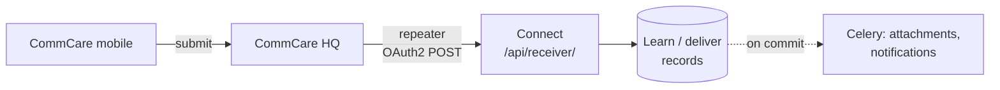
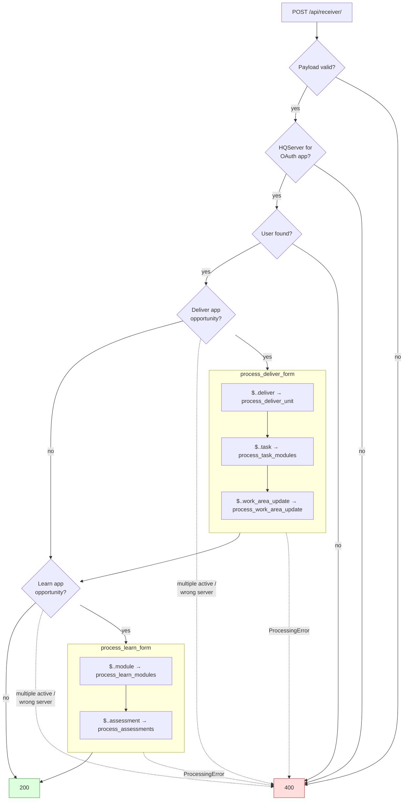

# Form Receiver

## Overview

Workers fill in learn and deliver forms in the CommCare mobile app. The forms are submitted to CommCare HQ, and HQ forwards each one to Connect. The form receiver is the single entry point for those forwarded forms. It turns them into Connect records:

- **Learn app forms** → training progress (`CompletedModule`, `Assessment`)
- **Deliver app forms** → paid work (`UserVisit`, `CompletedWork`), task completions (`AssignedTask`) and work-area inaccessibility requests (`WorkAreaInaccessibilityRequest`)

Everything Connect knows about a worker's training and fieldwork comes through here. What happens to those records afterwards (review, approval, payment) is covered in `../opportunity/README.md`.

## High-Level Flow

### The HQ side

Forwarding is configured per domain in HQ under **Project Settings → Data Forwarding**, with a `ConnectionSettings` that uses OAuth2 client credentials against Connect. Nothing creates it automatically.

- **Privilege:** the domain's plan needs HQ's `DATA_FORWARDING` privilege. Nothing is sent while HQ's `PAUSE_DATA_FORWARDING` toggle is on.
- **Domain toggle:** HQ's `COMMCARE_CONNECT` toggle (`commcare-hq: corehq/toggles/__init__.py`) enables the Connect question blocks in the form builder, the `ConnectFormRepeater` type, and the `connect_username` field Connect uses when it provisions HQ users. A plain `FormRepeater` does not need it.
- **Which forms are sent:** every form in the domain, not only Connect apps, except device logs and anything excluded by the forwarder's optional xmlns whitelist or user blocklist. Forms for apps with no active opportunity get a 200 and are ignored. Forms from users Connect doesn't know get a 400 (see Error Handling).
- **Connect URL:** HQ only applies its Connect-specific behaviour (404 retries, below) when the connection URL is exactly `https://connect.dimagi.com/api/receiver/`.

**Two payload shapes.** The domain picks one by choosing the repeater type:

| Repeater                                                            | Payload                                                                                                                          |
| ------------------------------------------------------------------- | -------------------------------------------------------------------------------------------------------------------------------- |
| `FormRepeater` (format must be set to JSON; the default is XML)     | The full form JSON, including every question and `attachments`                                                                   |
| `ConnectFormRepeater` ("Forward Form Metadata to Commcare Connect") | Only `domain`, `id`, `app_id`, `build_id`, `received_on`, `metadata`, and the Connect blocks inside `form`. **No `attachments`** |

On `ConnectFormRepeater` domains:

- No attachments are downloaded.
- `attachment_missing` flags every visit when that rule is on.
- Every inaccessibility request is rejected, because `photo_evidence` is never found.
- `FormJsonValidationRules` on questions outside the Connect blocks never match.

## Entry Point

`FormReceiver` in `views.py`, routed at `/api/receiver/` (`config/api_router.py`).

- `POST` takes one form as JSON. `GET` returns 200 and is used to test the connection and the OAuth credentials.
- **Auth:** OAuth2 bearer token with `read` and `write` scopes (`TokenHasReadWriteScope`).
- **Which HQ sent it:** `HQServer.objects.get(oauth_application=request.auth.application)`. Each HQ server must have its own OAuth application linked to an `HQServer` row.

## Processing Flow

All steps are in `processor.py` unless noted.

1. **Parse** (`serializers.py`): `XFormSerializer` validates the fields Connect needs into an `XForm` dataclass and keeps the whole body as `XForm.raw_form`.
2. **Find the server** (`views.py`): from the token's OAuth application.
3. **Find the user** (`get_user`): `metadata.username` is qualified to `{username}@{domain}.commcarehq.org` unless it already contains `@`, then matched against `ConnectIDUserLink.commcare_username`.
4. **Find the opportunity** (`get_opportunity`): an opportunity that is `active`, has `end_date >= today`, and whose deliver or learn `CommCareApp` matches `(domain, app_id)`. The app must belong to the server that sent the form.
5. **Find the Connect blocks** (`_get_matching_blocks`): JSONPath searches anywhere in `form` (`$..deliver`, `$..module`, …). Only blocks whose `@xmlns` is `http://commcareconnect.com/data/v1/learn` (`const.CCC_LEARN_XMLNS`) count. Learn and deliver blocks both use this namespace. Every match must be a dict with an `@xmlns` key, otherwise the form fails with a 500 (see Things to Consider).
6. **Process each block type** (see Validation & Business Rules).
7. **Respond** 200, and queue the async work after commit.

## Form Contract

Only these fields are read. Example payloads are in `tests/xforms.py`.

| Field                        | Used for                                                                           |
| ---------------------------- | ---------------------------------------------------------------------------------- |
| `id`                         | `xform_id` on every record created, and the idempotency key                        |
| `domain`, `app_id`           | Finding the opportunity                                                            |
| `build_id`                   | `app_build_id` on records                                                          |
| `metadata.timeStart/timeEnd` | Visit/completion date and form duration                                            |
| `metadata.username`          | Finding the user                                                                   |
| `metadata.location`          | Visit GPS, a string `"lat lon altitude accuracy"`                                  |
| `metadata.app_build_version` | `app_build_version` on records                                                     |
| `form` → Connect blocks      | What to create (table below)                                                       |
| `attachments`                | Attachment download, `attachment_missing` flag, photo evidence (full payload only) |

`received_on` is validated but not used.

| Block              | App     | Key fields                                                                  |
| ------------------ | ------- | --------------------------------------------------------------------------- |
| `module`           | learn   | `@id` (slug), `name`, `description`, `time_estimate`                        |
| `assessment`       | learn   | `user_score`                                                                |
| `deliver`          | deliver | `@id` (slug), `name`, `entity_id`, `entity_name`, `work_area_id` (optional) |
| `task`             | deliver | `@id` (task type slug)                                                      |
| `work_area_update` | deliver | `work_area_id`, `status`, `reason`, `photo_evidence`, `additional_details`  |

**Trusted from HQ:** the form's username, timestamps and GPS are taken as sent. `timeStart` is device time, so it decides the visit date and the daily-limit day.

## Validation & Business Rules

### Learn forms

- **Modules** (`process_learn_modules`): one `CompletedModule` per block, and `LearnModule` is created on first sight. When learning reaches 100%, `completed_learn_date` is set to the latest of each module's _earliest_ completion, so a re-taken module doesn't move it.
- **Assessments** (`process_assessments`): `passed = user_score >= app.passing_score`. Only one `Assessment` per `xform_id`, and a resent assessment form is rejected with a 400.
- **Access:** learn processing looks up `OpportunityAccess` without a guard, so a learn form from a worker with no access returns a 500 (unlike deliver, which returns a 400).

### Deliver forms: visits (`process_deliver_unit`)

Each `deliver` block becomes one `UserVisit`.

- **Required records:** `OpportunityAccess`, `OpportunityClaim`, an `OpportunityClaimLimit` for the deliver unit's `PaymentUnit`, and the `PaymentUnit` itself. A missing one gives a 400.
- **New deliver units:** a `DeliverUnit` seen for the first time is created without a `PaymentUnit`, so its forms are rejected until a program manager links one.
- **Concurrency:** the `OpportunityClaimLimit` row is locked (`select_for_update`) before visits are counted. That serializes concurrent forms for the same worker and payment unit, so two forms can't both pass the daily limit or the duplicate check.

**Visit status:** the visit starts as `pending`, and these rules apply in order.

| Step | Condition                                                            | Result                                                                          |
| ---- | -------------------------------------------------------------------- | ------------------------------------------------------------------------------- |
| 1    | Opportunity or payment unit `start_date` is after today              | `trial`, no `CompletedWork`                                                     |
| 2    | `check_visit_over_limit` finds any limit breached                    | `over_limit`, and the `CompletedWork` is `over_limit` too                       |
| 3    | A counted visit already exists for this `entity_id`                  | `duplicate`                                                                     |
| 4    | `clean_form_submission` runs the verification flags                  | Visit flagged; `duplicate` falls back to `pending` if the duplicate flag is off |
| 5    | `OpportunityAccess.suspended`                                        | `rejected`, flag `user_suspended`                                               |
| 6    | Worker has an active `AssignedTask` still assigned on this app       | `rejected`, flag `pending_task`                                                 |
| 7    | `automatic_visit_verification`, and the visit is `pending` + flagged | `rejected`                                                                      |
| 8    | `auto_approve_visits`, and the visit is `pending` + unflagged        | `approved`, `review_status=agree`                                               |

- **Counting:** steps 2–3 leave out `over_limit` and `trial` visits. The claim end-date limits compare against _today_ on the server; the daily limit uses the form's `timeStart` date.
- **Over-limit reasons:** every breached limit is recorded on `UserVisit.over_limit_reasons`, widest first: `claim_ended`, `claim_limit_ended`, `max_visits`, `max_daily`.
- **CompletedWork:** one per `(access, entity_id, payment_unit)`. `update_payment_accrued_for_user(..., incremental=True)` then recalculates its status and `payment_accrued` from all its visits. That recalculation, not the receiver, decides the final `CompletedWork` status.
- **Work areas:** a `work_area_id` in the block (a `WorkArea.case_id` UUID) links the visit and calls `WorkArea.update_status()`.

The verification flags themselves are listed in `../opportunity/README.md`.

### Deliver forms: tasks and work areas

- **Tasks** (`process_task_modules`): a `task` block completes the worker's `AssignedTask` of that type, only if it is still `ASSIGNED` with no `xform_id`. Otherwise the block is skipped.
- **Inaccessibility** (`process_work_area_update`): only `NOT_VISITED` → `REQUEST_FOR_INACCESSIBLE` is allowed, and only while no `PENDING` request exists for the work area. `reason` and `photo_evidence` are required, and `photo_evidence` must name an attachment on the form.

## Persistence

**One transaction per form.** `ATOMIC_REQUESTS` wraps the request, and DRF rolls it back on any `ProcessingError`. If the third `deliver` block fails, the first two are rolled back too.

| Record                           | Created from              | Unique on                                        |
| -------------------------------- | ------------------------- | ------------------------------------------------ |
| `LearnModule`, `DeliverUnit`     | first block seen          | none; `get_or_create` on app + slug only         |
| `CompletedModule`                | `module` block            | `xform_id, module, opportunity_access`           |
| `Assessment`                     | `assessment` block        | none; `get_or_create` lookup includes `xform_id` |
| `UserVisit`                      | `deliver` block           | `xform_id, entity_id, deliver_unit`              |
| `CompletedWork`                  | first visit for an entity | `opportunity_access, entity_id, payment_unit`    |
| `WorkAreaInaccessibilityRequest` | `work_area_update` block  | one `PENDING` per work area                      |

- `UserVisit.form_json` stores the whole payload. The visit details page re-parses it with `XFormSerializer`.
- `OpportunityAccess.last_active` is moved forward by completed modules, visits and tasks, but not by assessments.

## Async Processing

All are queued with `transaction.on_commit`, so they only run for forms that returned 200.

| Task (`opportunity/tasks.py`)                  | Trigger                 | Does                                                                      | Retries                    |
| ---------------------------------------------- | ----------------------- | ------------------------------------------------------------------------- | -------------------------- |
| `download_user_visit_attachments`              | each `UserVisit`        | Copies the form's attachments from HQ into `BlobMeta` / `AudioAttachment` | 5×, on httpx timeouts only |
| `download_inaccessibility_request_attachments` | inaccessibility request | Copies the photo evidence                                                 | 5×, on httpx timeouts only |
| `notify_user_for_scored_assessment`            | each `Assessment`       | Push notification to the worker                                           | none                       |

Attachments are fetched from HQ's form attachment API with the opportunity's `HQApiKey`, not with the OAuth token used for forwarding.

`update_payment_accrued_for_user` runs synchronously inside the request and takes a Redis lock per `OpportunityAccess` (`cache.lock`).

## Error Handling

| Situation                                                               | Connect returns      | HQ does                                                                                                                |
| ----------------------------------------------------------------------- | -------------------- | ---------------------------------------------------------------------------------------------------------------------- |
| Processed                                                               | 200                  | Marks success                                                                                                          |
| Known user, but no active opportunity for the app or no Connect blocks  | 200, nothing created | Marks success                                                                                                          |
| Resent visit or module form already processed                           | 200, logged at info  | Marks success                                                                                                          |
| Resent assessment or inaccessibility request                            | 400                  | Payload Rejected, never retried                                                                                        |
| Invalid payload, unknown user/server, missing claim, …                  | 400 `{"detail": …}`  | **Payload Rejected, never retried**                                                                                    |
| Missing or invalid token                                                | 401/403              | Payload Rejected, never retried                                                                                        |
| Unhandled exception (e.g. learn form with no access, missing block key) | 500                  | Retried with backoff (about 1h, 3h, 9h, 27h, 81h; each wait capped at 7 days), cancelled after about 6 failed attempts |
| Timeout or connection error                                             | none                 | Retried as for 500                                                                                                     |

- **Unknown users:** the user is looked up before the opportunity, so a form from any mobile worker in the domain without a `ConnectIDUserLink` gets a 400, even for apps with no opportunity.
- **HQ timeout:** 300s read by default. With HQ's `DECREASE_REPEATER_TIMEOUT` toggle it is 60s for all of the domain's data-forwarding requests.
- **HQ also retries 404** for the production Connect URL, because Connect's proxy returns 404 when overloaded.
- **A 400 is final.** Once the cause is fixed (for example, a payment unit is linked), the form has to be resent from HQ by hand.

`ProcessingError` messages, grouped by where they are raised:

- **Routing:** the token's OAuth app has no `HQServer` (detail is the generic "A server error occurred."); `Commcare User <username> not found`; `CommCare App <id> not found on <server>`; `Multiple active opportunities found for CommCare app <id>.`
- **Learn:** `User score must be an integer`; `Learn Assessment is already completed`.
- **Deliver:** `User does not have access to opportunity …`; `Payment unit is not configured for the deliver unit …`; `User has not claimed opportunity …`; `User has no claim limit for payment unit …`; `Invalid work area case id specified …`; `Work area not found`.
- **Work area update:** pending request already exists; user not assigned to the work area; invalid status or transition; missing `reason` / `photo_evidence`; photo attachment not found on the form.

## Debugging

**"A form was submitted but isn't in Connect"**

1. Get the form's `xform_id` from HQ, and check whether a record exists: `UserVisit`, `CompletedModule` or `Assessment` with that `xform_id`. All three are replicated to Superset.
2. **No record:** open HQ's **Data Forwarding Records** report (Project Settings) for the domain, find the form's record and use "View attempts" to see Connect's response body.
   - _Payload Rejected_ (filter: "Payload Error") is a 400/401/403 and is final. The body is the `ProcessingError` reason. Fix the cause, then resend the record.
   - _Failed_ means a 500, timeout or 404 that HQ will retry. _Cancelled_ means it ran out of retries.
   - _Pending_ means HQ hasn't sent it yet.
   - _No record at all_ means the domain has no repeater, lacks the `DATA_FORWARDING` privilege, has `PAUSE_DATA_FORWARDING` on, or the forwarder's xmlns whitelist or user blocklist excluded the form.
   - _Success but nothing in Connect_ means there was no active opportunity for the app (check `active` and `end_date`), or the form had no Connect blocks.
3. **Search Connect's web logs** for the `xform_id` or for `/api/receiver/`. 400s are logged by Django as "Bad Request" warnings. They are **not** sent to Sentry; only 500s are.
4. **"Commcare User … not found"**: compare the form's username with `ConnectIDUserLink.commcare_username`, including casing.

**"The visit is there but the status is wrong"**: walk the status table above in order. The flags and reasons are in `UserVisit.flag_reason` and `over_limit_reasons`.

**"Attachments are missing"**: check `form_json` has an `attachments` key. Without one, the domain uses `ConnectFormRepeater`. Then check Sentry and the Celery logs for `download_user_visit_attachments`.

## Things to Consider When Changing This

- **The payload is HQ's contract.** HQ sends it in two shapes (see The HQ side). Anything new that reads outside the Connect blocks won't work for `ConnectFormRepeater` domains.
- **The status code decides whether HQ retries.** Raise `ProcessingError` (400) only when resending the same form can never succeed. Errors that might be temporary should not be 400s, or the form is lost until someone resends it by hand.
- **Forms are resent, edited and out of order.** HQ can resend a form, and an edited form is resent with the **same `id`**. For visits and modules the unique constraints make that a no-op (200); resent assessments and inaccessibility requests get a 400. Either way, edits made in HQ after the first send never reach Connect. Forms also arrive out of order and late (HQ retries over days), so nothing here should assume order.
- **Duplicate handling depends on constraint names.** `views.py` matches `IntegrityError` by constraint name. Renaming a constraint changes a resend from a 200 to a 500, which HQ then retries. (`unique_xform_work_area_inaccessibility` in `views.py` matches no real constraint.)
- **Block names are matched anywhere in the form.** A question or group named `deliver`, `module`, `task`, `assessment` or `work_area_update` in a Connect app that isn't a Connect block (no `@xmlns`) makes `_get_matching_blocks` raise a 500.
- **Keep the claim-limit lock.** Anything that counts visits or checks duplicates must stay inside the `OpportunityClaimLimit` lock in `process_deliver_unit`.
- **Shared code:** `XFormSerializer` is also used by the visit details page (`opportunity/views.py`). `update_payment_accrued_for_user` and the verification flags belong to the opportunity app.
