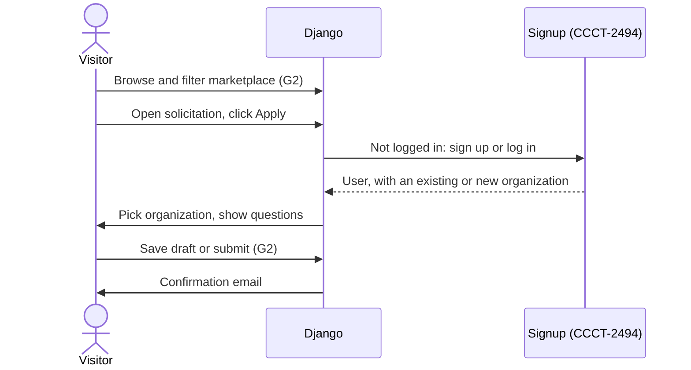
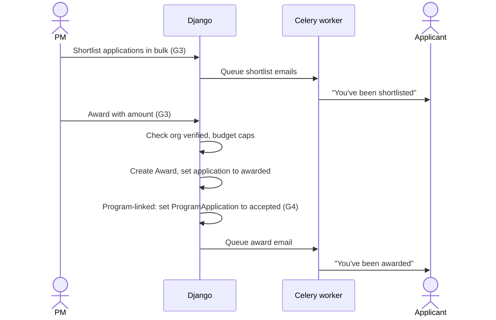
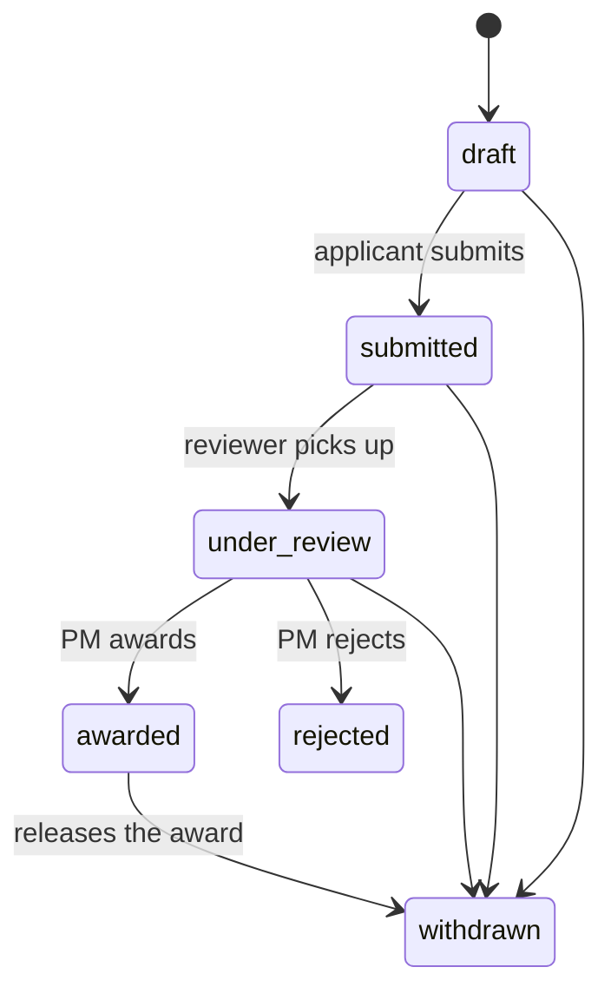

# Solicitations module: technical spec

**Status:** Draft for review
**Release:** behind a global feature switch, off by default.

## Overview

**Problem**

Program Managers (PMs) can only bring new partner organizations into a program by inviting organizations they already know. No public place exists where a locally led organization can find upcoming work and put itself forward.

Separately, the Delivery team regularly runs Requests for Proposals (RFPs) and Expressions of Interest (EOIs) to find new partners. They do this with Google Forms and a hand-maintained spreadsheet. The process is off-platform, unstructured and invisible to the rest of Connect.

**Current flow**

1. A PM finds a partner organization through their own contacts.
2. The PM invites that organization to a program.
3. The organization moves through *invited → applied → accepted*.
4. Once accepted, the PM sets up opportunities for that organization through the existing program screens.

**Goals**

- **G1.** A PM can post an RFP or EOI, either public or invite-only, and optionally tied to a program.
- **G2.** Anyone, logged in or not, can browse public postings. New users can sign up, and any user can apply on behalf of an organization.
- **G3.** Assigned reviewers can score applications against weighted criteria, and the PM can shortlist and award.
- **G4.** An award on a program-linked posting accepts the organization into that program, so the existing onboarding flow takes over from there.

**Solution in brief**

A new Solicitations module adds a public marketplace to Connect. PMs publish postings with a question form and a set of weighted scoring criteria. Organizations browse the marketplace and apply. Reviewers from the PM's organization score each application, and the PM shortlists and awards. When the posting is linked to a program, the award marks the organization as accepted into that program. From there the existing flow takes over, so the marketplace is a front door to onboarding, not a parallel system.

Out of scope for v1: contract generation and e-signature. A PM can attach a contract PDF signed outside Connect to an award.

**Terms used in this document**

- **Solicitation:** one posting on the marketplace, either an RFP or an EOI.
- **Funder org:** the organization that posts solicitations. Today that is any organization marked as a program manager organization.
- **Applicant:** the user applying on behalf of an organization.
- **Reviewer:** a user in the funder org assigned to score one solicitation's applications. An **observer** is assigned the same way but can only read.
- **Shortlist:** a reversible, PM-chosen set of applications under consideration for award.

## At a glance

| Area | Change |
|---|---|
| Django apps | New `solicitation` app, holding everything in this spec. See [Data model changes](#data-model-changes). |
| Data models | Ten new models. `Solicitation` is the posting itself, and `Application` is one organization's response to it. The rest hold questions, criteria, invites, reviews, scores and awards. No changes to existing models. |
| URLs and endpoints | Public marketplace under `/solicitations/`; PM and reviewer screens under each organization's `/a/<org_slug>/solicitations/`. See [URLs and endpoints](#urls-and-endpoints). |
| Background work | A daily job that closes solicitations past their deadline, a weekly digest email to PMs, and status emails to applicants and invited organizations. |
| External services | None. Emails go through the existing email setup. |
| Settings and feature flags | A new global switch, `solicitations`, that turns the whole module on or off. A new feature flag for the weekly PM digest. |
| Dependencies | None |
| Templates and frontend | Marketplace pages, the application form, PM management pages and reviewer scoring pages. New items in the public nav and org sidebar. |

## Assumptions

- **A1.** When a solicitation is linked to a program, its currency must match the program's currency. The original design caps awards by both budgets but doesn't say what happens when the two currencies differ. If wrong: the program budget check needs currency conversion, or the cap on the program budget is dropped.
- **A2.** A program's "remaining budget" means its budget minus the active awards on all solicitations linked to it. The `Program` model only stores a total budget today. If wrong: a different definition is needed, for example one that also subtracts the budgets of the program's existing opportunities.
- **A3.** A reviewer must be a member of the funder org that owns the solicitation. The review screens are scoped to that organization's URLs. If wrong: reviewers from other organizations need a separate way to reach the review screens.
- **A4.** Managing solicitations needs the same access as managing programs: an admin of a program manager organization. This is what the existing `OrgPMRequiredMixin` (the view guard used by program pages) checks. If wrong: non-admin members of the funder org need a new permission check.
- **A5.** When an awarded organization withdraws, its program application goes from *accepted* to *declined* (an existing status). If wrong: a new status is needed, or the program application is deleted.
- **A6.** CCCT-2494 (public signup and probationary organizations) ships before new external applicants are allowed in. Returning users who already belong to an organization can apply without it.

### Open questions for product

- The public nav label "Explore opportunities" clashes with Connect's existing "opportunities". The label may change. The URL and internal naming stay "solicitations".
- How an application's score is shown when a reviewer has scored only some criteria (partial scoring) isn't decided.

## Data model changes

All new models live in the `solicitation` app and extend the project's `BaseModel`, which adds created/modified user and timestamp fields. Public-facing models carry a UUID alongside the integer key, following the existing convention.

The following existing models are used without changes: `Organization`, `User`, `Program`, `Currency`, `Country`, `DeliveryType`, and `ProgramApplication`, the existing record of an organization's status in a program (invited, applied, accepted…).

### `Solicitation` (new)

**Purpose:** the posting itself. It holds everything shown on the marketplace plus the budget that caps awards.

| Field | Type | Notes |
|---|---|---|
| `solicitation_id` | UUID | Public identifier used in URLs. |
| `title` | Text (255) | |
| `type` | Choice: RFP, EOI | |
| `status` | Choice: draft, active, closed, cancelled | See [Lifecycles](#lifecycles). |
| `public` | Boolean | Public postings appear on the marketplace. Private ones are visible only to invited organizations. |
| `description` | Long text | The scope of work. |
| `budget_min`, `budget_max` | Whole number, optional | Shown to applicants. Active awards together may not exceed `budget_max`. |
| `currency` | Link to `Currency` | Required. Awards use this currency. |
| `country`, `delivery_type` | Links, optional | Marketplace filters. |
| `expected_start_date`, `expected_end_date` | Date, optional | |
| `application_deadline` | Date and time | Submissions are blocked after this. |
| `estimated_scale` | Text, optional | For example "5,000 households, 3 districts". |
| `contact_email` | Email | |
| `organization` | Link to `Organization` | The funder org that owns it. |
| `program` | Link to `Program`, optional | Exploratory EOIs may have no program. |
| `hide_scores_until_submit` | Boolean, default on | Reviewers can't see each other's scores until they submit their own. |
| `closure_reason` | Long text, optional | Required when a PM closes early or cancels. |

### `EvaluationCriterion` (new)

**Purpose:** one weighted dimension that reviewers score. It is internal only and never shown to applicants.

| Field | Type | Notes |
|---|---|---|
| `solicitation` | Link to `Solicitation` | |
| `label` | Text (255) | For example "Technical expertise". |
| `description` | Long text, optional | Guidance shown to reviewers while scoring. |
| `weight` | Percentage | A solicitation's weights must total 100% before it can be published. |
| `display_order` | Small number | |

### `SolicitationQuestion` (new)

**Purpose:** one question on the application form.

| Field | Type | Notes |
|---|---|---|
| `solicitation` | Link to `Solicitation` | |
| `text`, `help_text` | Long text | |
| `question_type` | Choice: text, number, choice, file, date | |
| `choice_options` | JSON, optional | Only for choice questions. |
| `required` | Boolean | |
| `display_order` | Small number | |
| `criterion` | Link to `EvaluationCriterion`, optional | Tells reviewers which criterion this answer informs. A criterion may cover several questions. |

### `SolicitationAttachment` (new)

**Purpose:** supporting documents for applicants, such as a scope PDF.

| Field | Type | Notes |
|---|---|---|
| `solicitation` | Link to `Solicitation` | |
| `file`, `filename` | File, text | |

### `SolicitationInvitation` (new)

**Purpose:** lets one organization see and apply to a private solicitation.

| Field | Type | Notes |
|---|---|---|
| `solicitation`, `organization` | Links | Unique together. |
| `invited_by` | Link to `User` | |

### `Application` (new)

**Purpose:** one organization's response to a solicitation.

| Field | Type | Notes |
|---|---|---|
| `application_id` | UUID | |
| `solicitation`, `organization` | Links | Unique together: one application per organization per solicitation. Keyed on the organization because `ProgramApplication` is too. |
| `submitted_by` | Link to `User` | |
| `submitter_name`, `submitter_email` | Text, email | Copied when the application is submitted, so the record survives changes to the user. |
| `status` | Choice: draft, submitted, under review, awarded, rejected, withdrawn | See [Lifecycles](#lifecycles). |
| `shortlisted` | Boolean, indexed | A separate flag, not a status. See [Decisions](#decisions). |
| `submitted_date`, `withdrawn_date` | Date and time | |
| `program_application` | Link to `ProgramApplication`, optional | Set on award for program-linked solicitations. |

### `ApplicationAnswer` (new)

**Purpose:** the applicant's answer to one question.

| Field | Type | Notes |
|---|---|---|
| `application`, `question` | Links | Unique together. |
| `answer` | JSON, optional | Text, number, choice or date answers. |
| `file` | File, optional | File-upload answers. |

### `ApplicationReviewer` (new)

**Purpose:** gives one user access to review one solicitation.

| Field | Type | Notes |
|---|---|---|
| `solicitation`, `user` | Links | Unique together. |
| `role` | Choice: reviewer, observer | Observers can read but not score. |
| `invited_by` | Link to `User` | |

### `Review` (new)

**Purpose:** one reviewer's assessment of one application.

| Field | Type | Notes |
|---|---|---|
| `application`, `reviewer` | Links | Unique together. |
| `recommendation` | Choice: approve, reject, needs revision | |
| `overall_score` | Decimal, out of 100 | Calculated from the criterion scores. See [Scoring](#scoring). |
| `notes`, `tags` | Long text, JSON | |
| `submitted_date` | Date and time, optional | Empty while the review is a draft. |

### `CriterionScore` (new)

**Purpose:** a reviewer's score for one criterion within a review.

| Field | Type | Notes |
|---|---|---|
| `review`, `criterion` | Links | Unique together. |
| `score` | Small number, 1–10 | The scale is fixed and the same for every criterion. |
| `comment` | Long text, optional | |

### `Award` (new)

**Purpose:** records that an application won, and for how much. A solicitation may have several awards.

| Field | Type | Notes |
|---|---|---|
| `application` | Link to `Application` | At most one award per application without a `released_date` (a database constraint). |
| `awarded_by` | Link to `User` | |
| `award_amount` | Whole number | In the solicitation's currency. |
| `released_date` | Date and time, optional | Set when the awarded organization withdraws. Released awards are kept for audit and don't count against the budget. |
| `comment` | Long text, optional | |
| `contract_file` | File, optional | A contract PDF signed outside Connect. |

## Architecture changes

### Django apps

A new `solicitation` app, modelled on the existing `program` app. Nothing moves between existing apps.

### URLs and endpoints

The module has four groups of pages, one for each audience. When the `solicitations` switch is off, every page returns 404.

| Route | Pages | Who can access | Goals |
|---|---|---|---|
| `/solicitations/`, `/solicitations/<id>/` | Marketplace list, solicitation detail | Anyone. Private solicitations are visible only to logged-in members of invited organizations. | G2 |
| `/solicitations/<id>/apply/` | Application form | Logged-in users applying as one of their organizations | G2 |
| `/a/<org_slug>/solicitations/applications/…` | "My applications" list and detail | Members of the applying organization | G2 |
| `/a/<org_slug>/solicitations/…` | Dashboard, create/edit, applications list, award, reviewer management, close/cancel | Funder org admins (see A4) | G1, G3, G4 |
| `/a/<org_slug>/solicitations/reviews/`, `/a/<org_slug>/solicitations/<id>/review/` | "My reviews" list, scoring page | Users with an `ApplicationReviewer` assignment on that solicitation | G3 |

The public marketplace sits outside `/a/<org_slug>/` because it must work without a login, like the existing marketing pages.

### Behaviour

#### Creating and publishing a solicitation (G1)

**Entry:** a PM opens "Solicitations" in their org sidebar and creates a draft.

- The PM fills in scope, budget, dates and contact email, builds the question form, adds weighted criteria, optionally links a program, chooses public or private, and assigns reviewers.
- Publishing checks that the criterion weights total 100% and moves the solicitation from draft to active.
- After publishing, questions and criteria are locked. Descriptive text and the deadline (extensions only) stay editable.
- For a private solicitation, the PM invites organizations. Each invite creates a `SolicitationInvitation` and emails the organization a link.

#### Discovering and applying (G2)

**Entry:** a visitor opens the marketplace from the public site nav.

- The public page shows scope, budget range and deadline. Questions appear only on the application form, and criteria are never shown to applicants.
- Logged-in users also see an "Invited" section listing private solicitations their organizations were invited to.
- Returning users pick one of their own organizations. There is no search across other organizations, because the organization list is private.
- A new user creates an organization during signup. It starts as probationary, pending verification by a Dimagi admin, but can still apply.
- Submitting is one-shot and blocked after the deadline. The check runs at submit time and doesn't wait for the daily close job.

#### Reviewing (G3)

**Entry:** a reviewer opens "My reviews" in the org sidebar.

- The reviewer sees only solicitations they are assigned to, in the current organization.
- Picking up an application moves it from submitted to under review, which emails the applicant.
- The reviewer scores each criterion from 1 to 10, with the PM's guidance shown beside it. They add notes and a recommendation, then save a draft or submit.
- With `hide_scores_until_submit` on, other reviewers' scores stay hidden until the reviewer submits their own. This reduces anchoring bias.
- Scores can only be created or changed while the application is under review.

#### Shortlisting and awarding (G3, G4)

**Entry:** the PM opens a solicitation's applications list from their dashboard.

- The list shows each application's status, shortlisted flag, average score, recommendations and how many reviews are done.
- Shortlisting is optional, can be undone at any time before award or rejection, and doesn't stop reviewers scoring. Every shortlist change emails the applicant.
- An award is blocked when:
  - the applicant organization isn't verified yet, or
  - active awards plus this one would exceed the solicitation's `budget_max`, or
  - for program-linked solicitations, the program's remaining budget (A2).
- For a program-linked solicitation, the award creates the organization's `ProgramApplication` or updates it to accepted. This unlocks the existing opportunity setup. The module doesn't create opportunities itself.
- The PM can reject the remaining applications in bulk with a templated email, and close or cancel a solicitation early with a reason.

#### Withdrawing after an award (G4)

**Entry:** an awarded applicant clicks Withdraw on their application.

- The award gets a `released_date`, so its amount no longer counts against the budget.
- The application moves to withdrawn.
- Any program application the award accepted moves to declined (A5).
- The PM can then award another applicant.

#### Lifecycles

- **Solicitation:** draft → active (on publish) → closed (deadline passed, or the PM closes early). Cancelled is a terminal state reachable from draft or active, and needs a reason. There is no "awarded" solicitation status: whether a solicitation has awards comes from its active `Award` rows.
- **Review:** draft → submitted.

#### Scoring

A review's overall score is the weighted average of its criterion scores, out of 100. The applications list shows the average of submitted reviews' overall scores.

| Criterion | Weight | Score (/10) | Contribution |
|---|---|---|---|
| Technical expertise | 25% | 8 | 20 |
| Past performance | 25% | 6 | 15 |
| Cost | 20% | 9 | 18 |
| Local presence | 30% | 7 | 21 |
| **Overall** | **100%** | | **74 / 100** |

### Background work and external services

All tasks are dispatched after the request's transaction commits, so the worker sees the new rows.

| Job | Trigger | Notes |
|---|---|---|
| Close expired solicitations | Daily scheduled task | Moves active solicitations past their deadline to closed. Submissions are blocked at the deadline regardless (see Discovering and applying). |
| Applicant emails | Every application status change, and every shortlist change | |
| Invitation emails | A PM invites an organization to a private solicitation | |
| PM digest | Weekly scheduled task | Per open solicitation: applications awaiting review, plus scores so far. If its feature flag doesn't exist, the task logs and returns, like the existing weekly performance report. |
| Broadcast to applicants | PM action | Emails all of a solicitation's applicants an update. |

### Templates and frontend

- Public marketplace list (filterable cards) and detail page, plus a new "Explore opportunities" item in the public nav (label to be confirmed, see open questions).
- Application form, with dynamic question types and file uploads.
- "My applications", "Solicitations" and "My reviews" items in the org sidebar.
- PM create/edit form, which includes a question builder and a criteria editor that shows the running weight total.
- Applications list with bulk shortlist and reject actions, the award screen, and the scoring page.

### Settings and feature flags

| Setting or flag | Default | Why |
|---|---|---|
| `solicitations` switch | Off | Turns the whole module on or off globally during rollout. |
| Weekly PM digest flag | Off | Lets the digest be turned on for some organizations first. |

## Decisions

| Decision | Alternative rejected | Reason |
|---|---|---|
| Store the budget on `Solicitation`. | A new fund model, or relying on the program's budget. | EOIs may have no program, and a fund model would add a concept for a single number. |
| Applicants apply as an `Organization`, using the shared signup from CCCT-2494. | The module's own signup, or the older `LLOEntity` model (being phased out). | `ProgramApplication` is keyed on organization, so the award handoff needs a real organization. One identity model is shared with the rest of Connect. |
| Shortlisting is a flag, not an application status. | A "shortlisted" status between under review and awarded. | Reviewers keep scoring shortlisted applications. A status would open or close the review window by accident. |
| A fixed 1–10 scale for every criterion, with percentage weights. | A scale configured per criterion. | Simpler for reviewers, and the PM can read relative importance directly off the weights. |
| Stop at accepting the organization into the program. | Creating the opportunity automatically. | The existing program flow already owns opportunity setup. |
| Contracts are uploaded by hand. | Generating contracts and e-signature. | Kept out of v1; planned for Phase 2. |

## Risks

- **Two awards made at once can exceed the budget.** Two PMs awarding at the same time could each pass the budget check. The award locks the solicitation row while it checks and saves.
- **Withdrawal after the opportunity already exists.** If the organization has already been set up with an opportunity, moving its program application back to declined doesn't undo that. The award screen and withdrawal confirmation should warn about this. Cleaning up downstream records stays manual.
- **Private files leak through public URLs.** Attachments and answer files for private solicitations must be served only after an access check, not from public media URLs.
- **New applicants depend on CCCT-2494.** If it slips, only users who already belong to an organization can apply. The returning-user path ships first.

## Optimization opportunities

- **Store each application's average score.** The applications list recalculates average scores on every load. Storing the average on `Application` would make the list faster, but it's deferred until the lists are large enough to need it.
