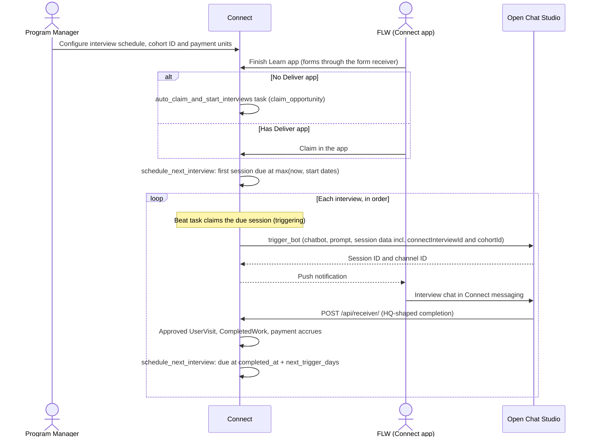

# Optional Deliver Apps and OCS Interview Units

**Jira Ticket:** [CCCT-2861](https://dimagi.atlassian.net/browse/CCCT-2861)

---

## Tech Spec

**Epic:** _Add Epic_
**Ticket Number & Description:** [CCCT-2861](https://dimagi.atlassian.net/browse/CCCT-2861) — Optional Deliver Apps and OCS Interview Units

| Field                      | Details                                                    |
| -------------------------- | ---------------------------------------------------------- |
| **Related Materials**      | [CCCT-2861](https://dimagi.atlassian.net/browse/CCCT-2861) |
| **Mockups / Wireframes**   | _Add link_                                                 |
| **Author**                 | Pawan Verma                                                |
| **Feature Release Path**   | Path 2: New features with stability                        |
| **Release Switch**         | Not required                                               |
| **Implementation Tickets** | 9 tickets, listed in order under Implementation Tickets    |

### Relevant Codebases

- [commcare-connect](https://github.com/dimagi/commcare-connect) — optional deliver app, interview unit and scheduler models, Program Manager UI, form receiver changes, mobile API fields.
- [commcare-android](https://github.com/dimagi/commcare-android) — skip the Deliver app launch after Learn when there is none; show interviews and interview payment units.
- [open-chat-studio](https://github.com/dimagi/open-chat-studio) — configuration only, no code changes: OCS is set up to post interview completions to Connect's form receiver in the HQ form shape.

---

### Introduction

This change lets an opportunity run without a CommCare Deliver app and adds OCS interviews as a paid unit of work. Interviews are modelled as a new kind of `DeliverUnit`, triggered one at a time by a per-opportunity scheduler, and completed through the existing form receiver. This lets them reuse the whole payment, claim-limit and invoicing pipeline instead of building a parallel one.

---

### Solution

**Proposed Solution:**

Interviews are modelled as a new kind of `DeliverUnit`, so they reuse payment units, `UserVisit`, `CompletedWork`, claim limits and invoicing. A per-opportunity scheduler triggers them one at a time through OCS. The first interview triggers once the FLW has a claim: on opportunities with no Deliver app, Connect claims the opportunity for them when they finish the Learn app; on opportunities with a Deliver app, the FLW claims in the app as today. No interview is ever paid without a claim. OCS posts each completion to the existing form receiver in the HQ form shape, using a dedicated OAuth application that Connect recognises through an `OCSServer` record.

**Flow:**



1. A Program Manager sets up the interview schedule (chatbot, prompt, session data, order, Next Trigger days), the opportunity's cohort ID, and payment units that use the interview units. The schedule locks when its first session is created.
2. The FLW finishes the Learn app. With no Deliver app, Connect claims the opportunity for them in a Celery task; with a Deliver app, the FLW claims in the app as today. Either way, the first interview session is created, due at the later of now and the opportunity and payment unit start dates.
3. The beat task claims each due session and triggers it through `ocs_api.trigger_bot`, and the FLW is notified.
4. The FLW has the interview chat with the OCS bot in Connect messaging.
5. OCS posts the completion to `/api/receiver/`. Connect records an approved `UserVisit`, payment accrues through `CompletedWork`, and the next interview is scheduled for `completed_at + next_trigger_days`.
6. Steps 3–5 repeat until the last interview is complete.

The work splits into 9 tickets:

| #   | Ticket                                                           | Repo             | Depends on |
| --- | ---------------------------------------------------------------- | ---------------- | ---------- |
| 1   | Make the Deliver app optional                                    | commcare-connect | —          |
| 2   | Android: skip the Deliver app after Learn                        | commcare-android | 1          |
| 3   | Extract the `claim_opportunity` service                          | commcare-connect | 1          |
| 4   | Interview data model                                             | commcare-connect | 1          |
| 5   | Interview schedule page and payment unit linking                 | commcare-connect | 4          |
| 6   | Trigger interviews: auto-claim on Learn completion and beat task | commcare-connect | 3, 5       |
| 7   | Receive interview completions through the form receiver          | commcare-connect | 5, 6       |
| 8   | Mobile API: interview fields                                     | commcare-connect | 4, 7       |
| 9   | Android: show interviews and auto-claimed opportunities          | commcare-android | 8          |

- **External components:** OCS (trigger API, which already exists, and a completion post to Connect that is configured in OCS with no code changes). Mobile app changes in commcare-android.
- **Auto-claim:** `claim_opportunity(access)` is extracted from `ClaimOpportunityView` (opportunity row lock, budget and end-date checks, `OpportunityClaim` and `create_claim_limits`, and `create_hq_user_and_link` on the Deliver app's domain only when the opportunity has a Deliver app). The view and the Learn-completion task both call it, so manual and automatic claims follow the same budget rules. Learn processing never claims inline: it dispatches `auto_claim_and_start_interviews(access_id)` on commit, so a claim failure can't fail or slow the Learn form. Only opportunities with no Deliver app are auto-claimed, so auto-claim never makes the HQ call; on opportunities with a Deliver app, the FLW claims manually as today and their interviews start at that point.
- **Security:**
  - The receiver only takes the OCS path for requests whose OAuth application matches an `OCSServer` record, with read/write scope. Requests from any other application keep the HQ path.
  - Each payload must reference an existing `InterviewSession` whose FLW matches `metadata.username`, so OCS cannot create visits for arbitrary users or units.
  - Interview units have no `app`. Every `DeliverUnit` query that filters by `app=opportunity.deliver_app` is patched, because `filter(app=None)` matches `app IS NULL` and would return every opportunity's interview units.
  - Triggering uses the OCS OAuth token of the Program Manager who owns the schedule's OCS connection (`InterviewSchedule.configured_by`), as OCS tasks do today.
- **Scaling:** the beat task selects due sessions with `select_for_update(skip_locked=True)` and an index on (`status`, `scheduled_for`), moves each to `triggering` in the same transaction and dispatches `trigger_interview_session` on commit. The worker only proceeds while the session is still `triggering`, so a session is never triggered twice. At most one open session exists per FLW per opportunity, so volume is bounded by active FLWs.
- **Limitations:**
  - An interview the FLW never finishes blocks the rest of their schedule until a Program Manager re-triggers or skips it.
  - Triggering depends on one Program Manager's OCS connection. Another Program Manager can take it over explicitly.
  - The schedule can't be edited once its first session exists, except to take over the OCS connection.
  - Form deliver units and interview units can't share a payment unit, because their `entity_id`s differ.
  - Opportunities with no Deliver app have no tasks (neither relearn nor OCS).
- **API changes:** `/api/receiver/` accepts OCS-sourced payloads. The mobile opportunity serializer emits `deliver_app: null`, `unit_type` on payment units and visits, and a new `interviews` list.
- **Error logging:** missing configuration (no OCS account for `configured_by`, unset `OCS_BASE_URL`) is logged and marks the session `failed` without retrying. Transient OCS errors retry with backoff (`autoretry_for` + `retry_backoff`) up to a small cap, then mark the session `failed` with `last_error`. A timed-out trigger is ambiguous (OCS may have created the session), so it is never retried past the cap; the Program Manager re-triggers it. Receiver payloads with an unknown or mismatched `interview_session_id` raise `ProcessingError` and are logged, as other invalid forms are.

**Monitoring and Alerting Plan:**

- Log every trigger attempt and failure with the session ID and opportunity.
- Log auto-claim failures (budget full, opportunity ended) with the access and the reason.
- On the opportunity page, show a banner to Program Managers when sessions are `failed` because of OCS credentials.
- On the worker page, flag sessions that have been `triggered` for more than 7 days.
- Add Sentry alerts on `ProcessingError` rates from OCS-sourced receiver calls and on `trigger_interview_session` final failures.
- Dashboard counts: sessions by status per opportunity. _Add analytics destination_

**Deployment and Release:**

- Migrations are additive and run with `migrate_multi`; the beat task is registered by data migration.
- Mobile: opportunities with no deliver app are hidden from clients below the new mobile API version (_Add version_), so older apps never see `deliver_app: null`.
- OCS must be configured with the Connect OAuth client and receiver URL, and an `OCSServer` record created for that OAuth application, before the feature is used.
- Rollback: revert the deploy. Already-recorded interview visits stay as ordinary approved visits.

**Alternative Solutions:**

- **A dedicated completion endpoint** (like `TaskCompletedView`), calling the same helpers extracted from `process_deliver_unit`. It would give OCS a smaller, explicit payload instead of an HQ-shaped one. Rejected for v1 to keep a single entry point for visit-producing submissions.
- **A separate `InterviewUnit` model with its own accrual path.** Rejected because it would need parallel versions of `calculate_completed`, visit listings, exports, invoicing and the mobile payment views, and the two paths would drift.
- **Sending `connectInterviewId` in `participant_data`** (as OCS tasks send `connectTaskId`). Rejected because OCS participant data belongs to the participant, not the session: two open sessions on the same chatbot for one FLW would overwrite each other's ID.

---

### Implementation Tickets

#### Ticket 1 – Make the Deliver app optional

**Repo:** commcare-connect · **Depends on:** —

**Changes:**

- Add `Opportunity.has_deliver_app` (`deliver_app_id is not None`).
- Guard with it: `get_application` (`commcarehq/views.py`), `OpportunityChangeForm.clean_active`, `sync_learn_modules_and_deliver_units` and its callers, `verification_flags_config`, `UserVisit.hq_link` (returns `None` for interview visits), the HQ link in `user_task_details`, and `ClaimOpportunityView`, which skips `create_hq_user_and_link` when the opportunity has no Deliver app.
- Patch every query that filters `DeliverUnit` or `TaskType` by `app=opportunity.deliver_app`, because once interview units exist `filter(app=None)` returns every opportunity's interview units:
  - `opportunity/views.py`: `OpportunityDashboard`, `verification_flags_config`, `TaskTypesConfig`, `deliver_unit_table`
  - `opportunity/forms.py`: `DeliverUnitFlagsForm`, `FormJsonValidationRulesForm`, `CreateTaskForm`
  - `program/api/serializers.py`: `get_deliver_app`
  - `opportunity/api/serializers/automation.py`: the payment unit deliver-unit validation, which must accept the opportunity's interview units and reject other opportunities' units
- The other callers of the Deliver app's domain (work-area case sync, attachment downloads, usercase updates for relearn tasks) only run when a Deliver app exists, so they are unchanged.
- Hide the Deliver app link (`opportunity_resource_modal.html`), "sync deliver units", verification flags and microplanning when there is no Deliver app.
- Tasks are disabled when there is no Deliver app: hide the Tasks UI and nav item, and reject task type creation and task assignment. `TaskType.app` stays required.
- `OpportunityInitForm` and `OpportunityInitUpdateForm`: the deliver domain and app fields become optional (with help text); skip `_build_commcare_app("deliver")` when empty; compare learn and deliver apps only when both are set.
- Program API serializer (`program/api/serializers.py`): `deliver_app` becomes `required=False, allow_null=True`; `get_deliver_app` returns `null` when absent.
- `OpportunitySerializer` (mobile) and the data export serializer emit `deliver_app: null` when absent.
- Opportunities with no Deliver app are left out of the opportunity list for clients below the new mobile API version (`AcceptHeaderVersioning`; _Add version_).

**Acceptance criteria:**

- Every page and task above works for an opportunity with `deliver_app=None`, with no 500s.
- `get_application` still lists apps for a domain that contains an opportunity without a Deliver app.
- Tests parametrized over "with" and "without Deliver app" using a new `opportunity_without_deliver_app` fixture.
- Two opportunities without a Deliver app never see each other's interview units in any page, form or API listed above, and the automation API rejects another opportunity's unit.
- A Program Manager can create, edit and activate an opportunity with no Deliver app, through the web and the program API.
- An opportunity with no Deliver app shows no Tasks UI, and task types can't be created on it.
- Older clients never receive an opportunity with `deliver_app: null`; new clients receive it, and can claim it (no HQ user is created).

#### Ticket 2 – Android: skip the Deliver app after Learn

**Repo:** commcare-android · **Depends on:** 1

**Changes:**

- After the Learn app completes, skip the Deliver app download and launch when `deliver_app` is null.
- Send the new API version header.

**Acceptance criteria:**

- An FLW on an opportunity with no Deliver app finishes Learn and is not prompted to install or open a Deliver app.
- Opportunities with a Deliver app behave as today.

#### Ticket 3 – Extract the `claim_opportunity` service

**Repo:** commcare-connect · **Depends on:** 1

**Changes:**

- Move the body of `ClaimOpportunityView` into `claim_opportunity(access)`: the opportunity row lock, budget and end-date checks, `OpportunityClaim` and `OpportunityClaimLimit.create_claim_limits`, and the HQ user link.
- The Deliver app check is optional: when `has_deliver_app` is true, call `create_hq_user_and_link` on the Deliver app's domain as today; when it is false, skip the call. FLWs already get an HQ user on the Learn domain from `start_learn_app`.
- The HQ link is idempotent and also runs when the opportunity is already claimed. Today the claim is saved before the HQ call, so when the HQ call fails the claim persists and every retry returns "already claimed" without linking the user. Ensuring the link on the already-claimed path fixes retries and repairs FLWs who are stuck in that state.
- It returns a result the view maps to its existing responses and error codes.

**Acceptance criteria:**

- `ClaimOpportunityView` responses and error codes are unchanged.
- The service can be called outside a request (from a Celery task).
- When the HQ call fails on the first claim, a retry creates the HQ user link.

#### Ticket 4 – Interview data model

**Repo:** commcare-connect · **Depends on:** 1

**Changes:**

- `DeliverUnit`:
  - Add `unit_type` (choices `form` / `ocs_interview`, default `form`).
  - Add `opportunity` (FK, nullable).
  - Make `app` nullable.
  - Add a check constraint: `form` requires `app`; `ocs_interview` requires `opportunity` and no `app`.
- Add `Opportunity.available_deliver_units()`: the Deliver app's form units plus the opportunity's interview units.
- `Opportunity`:
  - Add `cohort_id` (CharField, blank). It is sent to OCS in `session_data` on every interview trigger.
- New `InterviewSchedule`:
  - `opportunity` (OneToOne)
  - `configured_by` (FK User, `SET_NULL`): the Program Manager whose OCS connection triggers interviews.
  - `active`
  - `is_locked`: true once any `InterviewSession` exists for the opportunity.
- New `OCSInterview` (one row per interview in the schedule; the scheduler's columns):
  - `schedule` (FK `InterviewSchedule`, `CASCADE`): the schedule this interview belongs to.
  - `deliver_unit` (OneToOne interview `DeliverUnit`, `PROTECT`): the Interview ID column; the OCS interview unit.
  - `ocs_chatbot_id`: the Chatbot column; the OCS chatbot that runs this interview.
  - `prompt_text` (TextField, blank): the Prompt column; sent as `prompt_text` to start the conversation, not shown to the FLW.
  - `session_data` (JSONField, default `dict`): the Session data column; sent as `session_data` on trigger, with Connect's keys added.
  - `order` (PositiveInteger): the Order column; unique per schedule.
  - `next_trigger_days` (PositiveInteger): the Next Trigger column; days after this interview is completed before the next one triggers; unused on the last row.
- New `InterviewSession`:
  - `interview_session_id` (UUID)
  - `opportunity_access` (FK)
  - `ocs_interview` (FK `OCSInterview`); the interview unit is `ocs_interview.deliver_unit`
  - `status` (`scheduled`, `triggering`, `triggered`, `completed`, `failed`, `skipped`, `cancelled`). `skipped` is a Program Manager decision and is final; `cancelled` (FLW suspended, opportunity ended) can be reopened.
  - `scheduled_for`
  - `triggered_at`
  - `completed_at`
  - `ocs_session_id`
  - `connect_channel_id`
  - `attempts`
  - `last_error`
  - `user_visit` (OneToOne, nullable)
  - Unique on (`opportunity_access`, `ocs_interview`); index on (`status`, `scheduled_for`).
- New `OCSServer`, mirroring `HQServer`: `name` and `oauth_application` (OneToOne to the OAuth application OCS uses for receiver access).

**Acceptance criteria:**

- Migrations are additive, run with `migrate_multi`, and existing `DeliverUnit` rows backfill to `unit_type=form`.
- The `DeliverUnit` check constraint rejects invalid combinations.
- Constraints enforce one schedule per opportunity, unique interview order per schedule and one session per FLW per interview.

#### Ticket 5 – Interview schedule page and payment unit linking

**Repo:** commcare-connect · **Depends on:** 4

**Changes:**

- New class-based view `InterviewScheduleView` (`opportunity:interview_schedule`): Program Manager CRUD for interview units and schedule rows, as an orderable table (Interview, Chatbot, Prompt, Session data, Order, Next Trigger in days, session counts). The page also edits the opportunity's `cohort_id`.
- Session data is edited as JSON and must be an object. The keys Connect sets (`connectInterviewId`, `cohortId`) are reserved and rejected.
- The schedule is locked once its first session exists: interviews, order, prompts, session data, Next Trigger days and `cohort_id` become read-only, and the page says why. Taking over the OCS connection stays available.
- OCS connection takeover: saving the schedule does not change `configured_by`. A "Use my OCS connection" action sets `configured_by` to the current Program Manager after checking their token with `ocs_api.list_chatbots`. The page shows the current owner and whether their connection works. It is the only way `configured_by` is set, including on first setup.
- The schedule can only be activated when every interview's unit belongs to a payment unit.
- The chatbot select is a tom-select (`data-tomselect="1"`) loaded from `ocs_api.list_chatbots`. If the Program Manager hasn't connected OCS, show `ocs/_connect_prompt.html`; if `OCS_BASE_URL` is unset, hide the page and nav item.
- `add_payment_unit` / `edit_payment_unit` / `PaymentUnitForm`: choices come from `available_deliver_units()`, grouped as "Form deliver units" and "OCS interviews".
- A payment unit's required and optional units must all be one `unit_type`; mixed payment units are rejected.
- Individual payment = one payment unit per interview unit; set payment = one payment unit with several required interview units.

**Acceptance criteria:**

- A Program Manager can add, reorder and remove interviews and set Next Trigger days until the first session exists.
- Once a session exists, every edit except the OCS connection takeover is rejected, in the UI and on the server.
- Saving the schedule never changes `configured_by`; the takeover action does, and fails with a clear error when the Program Manager's OCS token doesn't work.
- Invalid session data JSON (not an object, or using a reserved key) fails validation with a clear error.
- The schedule can't be activated while an interview has no payment unit.
- The page degrades as described when OCS isn't connected or configured.
- A Program Manager can create payment units from interview units, individually or as a set.
- Mixed-type payment units fail validation with a clear error.

#### Ticket 6 – Trigger interviews: auto-claim on Learn completion and beat task

**Repo:** commcare-connect · **Depends on:** 3, 5

**Changes:**

- Learn processing (`update_completed_learn_date` and `process_assessments` in `form_receiver/processor.py`): when an FLW first finishes Learn (`completed_learn_date` set and assessment passed) on an opportunity with an active schedule and no Deliver app, dispatch `auto_claim_and_start_interviews.delay(access.pk)` with `transaction.on_commit`. Learn processing itself never claims.
- `auto_claim_and_start_interviews(access_id)` is idempotent: it re-checks the preconditions, calls `claim_opportunity`, then `schedule_next_interview(access)`. Both Learn-completion paths (modules and assessment) can dispatch it safely.
- If the claim fails (budget full, opportunity ended), no interviews start and the failure is logged.
- Opportunities with a Deliver app are never auto-claimed. `ClaimOpportunityView` calls `schedule_next_interview(access)` on commit after a successful claim when the opportunity has an active schedule.
- `schedule_next_interview(access)` is the only place sessions are created or reopened, and it is idempotent:
  - It does nothing if the FLW already has an open session (`scheduled`, `triggering`, `triggered`, `failed`).
  - Otherwise it picks the lowest-order interview with no `completed` or `skipped` session for this FLW, and creates its session, or reopens a `cancelled` one.
  - `scheduled_for` is the latest of: now (or `completed_at + next_trigger_days` of the previous interview), `opportunity.start_date` and the interview's payment unit `start_date`. Interviews never run before they can be paid; otherwise the visit would be a `trial` visit and never paid.
  - The selection rule is a pure function over plain data, so it can be unit tested without the database.
  - It is called on claim, completion, skip, un-suspension, opportunity end-date extension and schedule reactivation.
- Beat task `trigger_due_interview_sessions` (every 5 minutes, registered by data migration) selects due `scheduled` sessions with `select_for_update(skip_locked=True)`, moves them to `triggering`, increments `attempts` and dispatches `trigger_interview_session` with `transaction.on_commit`. Sessions stuck in `triggering` for more than 30 minutes are picked up again.
- `trigger_interview_session` locks the session and returns unless it is still `triggering`. It then calls `ocs_api.trigger_bot(configured_by, identifier=<username>, experiment=ocs_interview.ocs_chatbot_id, prompt_text=ocs_interview.prompt_text, session_data={**ocs_interview.session_data, "connectInterviewId": <session uuid>, "cohortId": opportunity.cohort_id})`, stores `ocs_session_id` / `connect_channel_id` and sets `status=triggered`.
- `ocs_api.trigger_bot` gains a `prompt_text` parameter; the current hard-coded training prompt becomes the default, so OCS tasks are unchanged. A blank interview prompt is sent as `None` and gets that default. `cohortId` is omitted when `cohort_id` is blank.
- Transient OCS errors retry with `autoretry_for` + `retry_backoff`, capped at a small number of attempts, then mark the session `failed` with `last_error`. Missing configuration marks the session `failed` without retrying.
- Sessions are cancelled when the FLW is suspended or the opportunity ends, and reopened through `schedule_next_interview` when the FLW is un-suspended or the end date is extended.
- Worker page: an interview sessions panel with re-trigger and skip actions. Sessions `triggered` for more than 7 days are flagged. Re-trigger moves the session back to `scheduled`, due now. Skip marks it `skipped` (unpaid) and calls `schedule_next_interview`.
- The opportunity page shows a banner when sessions fail because of OCS credentials.

**Acceptance criteria:**

- On an opportunity with no Deliver app, finishing Learn creates a claim and triggers the first interview within one beat interval.
- On an opportunity with a Deliver app, finishing Learn creates no claim; claiming in the app triggers the first interview within one beat interval.
- A Learn form is processed normally when the auto-claim fails.
- No interview triggers before the opportunity or payment unit start date.
- The trigger call carries the interview's prompt, its session data plus `connectInterviewId` and `cohortId`.
- No interview triggers for an FLW without a claim.
- Running `trigger_interview_session` twice for the same session makes one OCS call.
- A trigger that keeps failing stops at the retry cap and ends `failed`.
- A failed trigger is visible on the worker page and can be re-triggered.
- A suspended and then un-suspended FLW resumes at the interview they were on.

#### Ticket 7 – Receive interview completions through the form receiver

**Repo:** commcare-connect · **Depends on:** 5, 6

**Changes:**

- OCS has a dedicated OAuth application in Connect, used only for receiver access, linked from an `OCSServer` record.
- `FormReceiver.post` checks `request.auth.application`: if it matches an `OCSServer`, the request goes to a new `process_ocs_interview_xform(xform)`; everything else keeps the HQ path. With no `OCSServer` record the HQ path is unchanged.
- Processing locks the `InterviewSession` found from the deliver block's `interview_session_id`, checks that its FLW matches `metadata.username`, then branches on its status:
  - `completed`: return 200 and do nothing.
  - `cancelled` or `skipped`: return 200, log it and record nothing.
  - `triggering`, `triggered` or `failed`: record the visit, mark the session completed and call `schedule_next_interview`, all in one atomic block. `failed` is accepted because OCS may have created the session even though Connect's trigger call timed out.
- Completions from an earlier OCS session after a re-trigger are handled by the same status rules, so the interview is paid once and the next one is scheduled once.
- `process_deliver_unit` is split into small helpers (claim lookup and claim-limit lock, visit counts, trial and over-limit handling with `CompletedWork`, finalizing `CompletedWork`). `process_deliver_unit` and the interview path each compose them with their own status rules, rather than sharing one helper with flags. `update_payment_accrued_for_user` is called by both.
- For interviews: `entity_id` = the FLW's `User.user_id`, `xform_id` = the OCS session ID, `form_json` = the OCS payload. Status is always `approved` + `review_status=agree` unless over limit or the FLW is suspended. `clean_form_submission`, the blocking-task check and attachment downloads are skipped.
- A missing claim raises `ProcessingError`, as for forms.

`POST /api/receiver/` (existing endpoint):

- Auth: OAuth2 bearer token from the OCS OAuth application, scope read/write.
- Request body (HQ form JSON shape, validated by `XFormSerializer`):

```json
{
  "domain": "ocs",
  "id": "<ocs_session_id>",
  "app_id": "<ocs_chatbot_id>",
  "build_id": null,
  "received_on": "2026-10-09T10:15:00Z",
  "metadata": {
    "timeStart": "2026-10-09T09:50:00Z",
    "timeEnd": "2026-10-09T10:14:30Z",
    "app_build_version": null,
    "username": "<connect username>",
    "location": null
  },
  "form": {
    "@xmlns": "http://commcareconnect.com/data/v1/learn",
    "deliver": {
      "@xmlns": "http://commcareconnect.com/data/v1/learn",
      "@id": "<interview unit slug>",
      "name": "<interview unit name>",
      "entity_id": "<FLW user_id>",
      "entity_name": "<FLW name>",
      "interview_session_id": "<connectInterviewId>"
    },
    "interview": { "summary": "_[Add fields OCS will send]_" }
  }
}
```

- Response: `200` on success, on a duplicate, and on a completion for a `cancelled` or `skipped` session. `400` when serializer validation fails. Processing errors (unknown or mismatched session) follow the receiver's existing `ProcessingError` handling.

**Acceptance criteria:**

- A completion creates exactly one approved `UserVisit` and updates `CompletedWork` and accrued payment.
- Posting the same completion twice creates one visit and schedules one next interview.
- A late completion from an earlier OCS session, after a re-trigger, creates no second paid visit and no second next interview.
- A completion for a `cancelled` or `skipped` session records nothing.
- A completion for a `failed` session is recorded.
- A set payment unit pays only after its last required interview.
- HQ form processing is unchanged.

#### Ticket 8 – Mobile API: interview fields

**Repo:** commcare-connect · **Depends on:** 4, 7

**Changes:**

- `OpportunitySerializer`: `payment_units[].unit_type` (`form` | `ocs_interview`) and `interviews[]` (`interview_session_id`, `name`, `status`, `scheduled_for`, `completed_at`, `connect_channel_id`, `order`) for the requesting FLW.
- Load interviews with a `Prefetch` on the requesting FLW's accesses: `InterviewSession.objects.select_related("ocs_interview__deliver_unit").order_by("ocs_interview__order")`, into a `to_attr`, so the query count doesn't depend on the number of opportunities.
- `UserVisitViewSet`: visits gain `unit_type`.

**Acceptance criteria:**

- An FLW's opportunity response lists their interviews in order with current status.
- A `django_assert_num_queries` test shows the query count is the same for one and several opportunities.
- Existing fields are unchanged.

#### Ticket 9 – Android: show interviews and auto-claimed opportunities

**Repo:** commcare-android · **Depends on:** 8

**Changes:**

- Add an interviews list with status, which opens the chat via `connect_channel_id`.
- Label interview-based payment units and visits.
- Show auto-claimed opportunities as claimed after Learn, with no Claim step.

**Acceptance criteria:**

- An FLW sees each interview's status and can open the active one.
- Earnings from interviews show alongside other payment units.

---

### Further Considerations

- **Auto-claim scope:** only opportunities with no Deliver app are auto-claimed. On opportunities with a Deliver app, auto-claiming would either skip HQ user creation on the Deliver domain (breaking Deliver forms) or make that HQ call in the form receiver, and would reserve the full per-user budget for FLWs who may never deliver.
- **Auto-claim failures:** if the budget is full when an FLW finishes Learn, they get no claim and no interviews. Confirm whether they should be told in the app, and whether a later budget increase should retry the claim.
- **Mixed payment units:** disallowed in v1, because form visits use a beneficiary `entity_id` and interviews use the FLW. Confirm no program needs "form + interview" sets.
- **OCS credentials:** triggering uses one Program Manager's OCS token. If that Program Manager leaves or disconnects, every trigger fails until another Program Manager takes over the connection. Consider an org-level OCS service token.
- **Stalled interviews:** with one-at-a-time triggering, an abandoned interview blocks the rest. v1 flags it after 7 days and lets a Program Manager re-trigger or skip it; skipped interviews are never paid.
- **Schedule lock:** the schedule is set up before FLWs start. Once the first session exists it can't be changed, so there is no backfill for FLWs who claimed or finished Learn before the schedule existed, and no handling for interviews reordered or added mid-run.
- **Session data from OCS:** confirm that the OCS pipeline that posts completions can read `connectInterviewId` from session data.
- **Payload contract with OCS:** agree the exact `form.interview` fields and the `id` uniqueness rule (`xform_id` max length is 50).
- **Mobile compatibility:** agree the minimum mobile API version for opportunities with no Deliver app.
- **QA:** test opportunities with a Deliver app only, interviews only, and both. Cover Learn finishing through module completion and through the assessment, auto-claim when the budget is full or the opportunity has ended, an FLW who had already claimed manually, duplicate OCS posts, late posts after a re-trigger, suspended FLWs, FLWs who finish Learn before the start date, and over-limit.
